# Expense Tracker

[](#)
[](#)
[](#)
[](#)
[](https://opensource.org/licenses/MIT)
[](https://github.com/psf/black)

This project was meant to be private but I'm using Github Pages to host for free. The FireStore config is meant to be public.
# Run locally

Clone the repo locally:
```git clone https://github.com/wescules/expense-tracker.git```

Start up a server:
```python -m http.server 8000```

Open browser:
```http://localhost:8000/index.html```

# Screenshots

Dashboard Showcase:

| | Desktop View | Mobile View |
| --- | --- | --- |
| Dark | 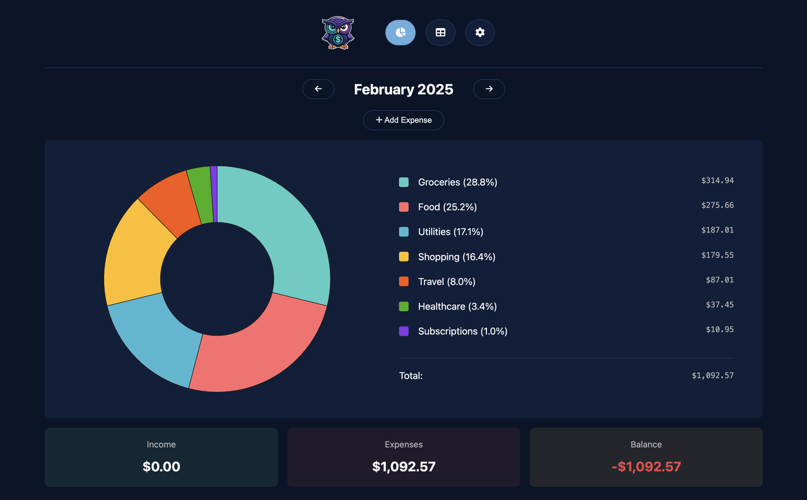 | 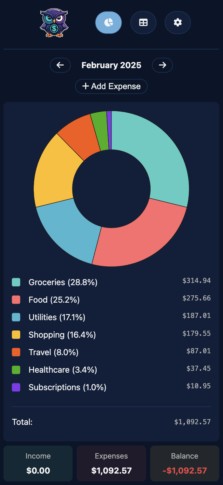 |
| Light | 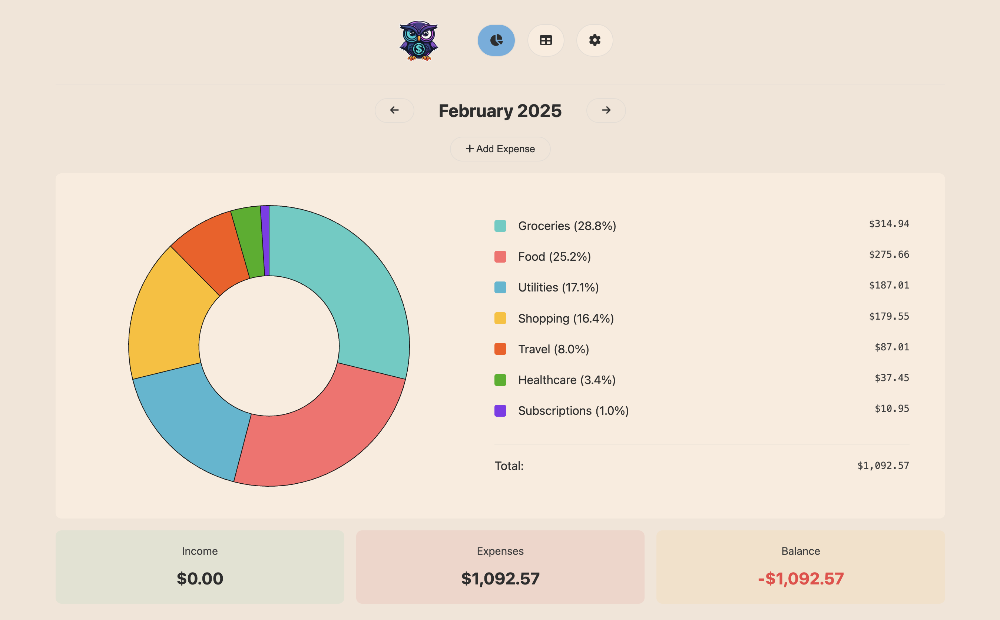 | 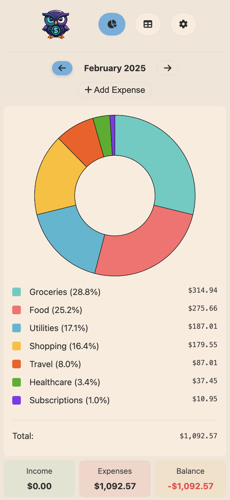 |

<details>
<summary>Expand this to see screenshots of other pages</summary>

| | Desktop View | Mobile View |
| --- | --- | --- |
| Table Dark | 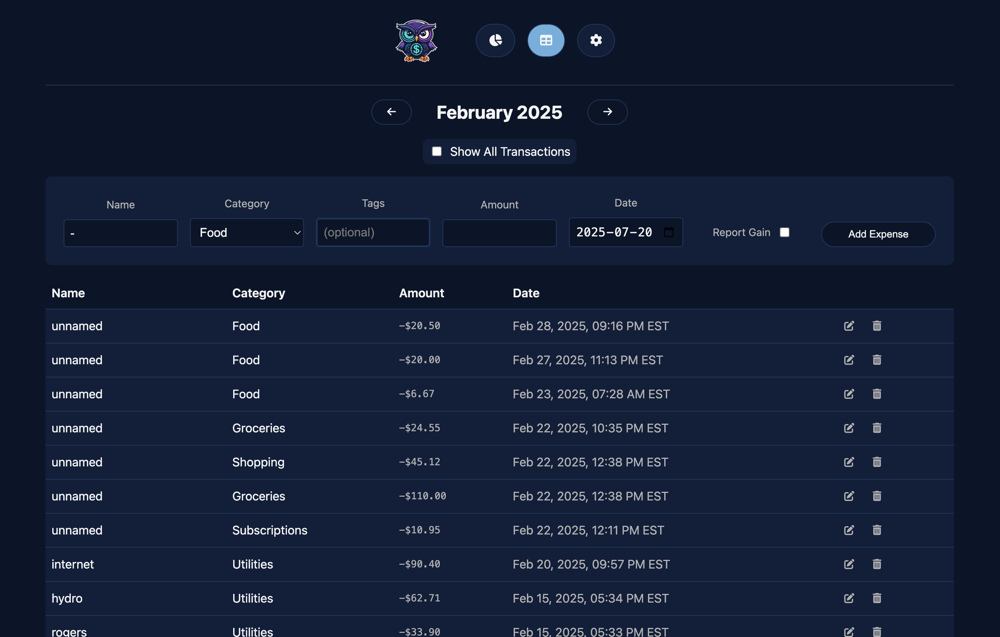 | 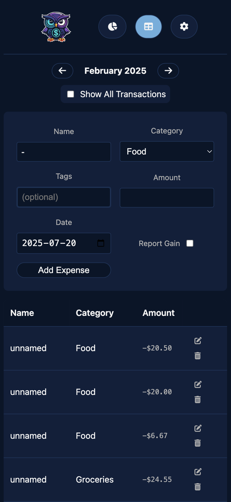 |
| Table Light | 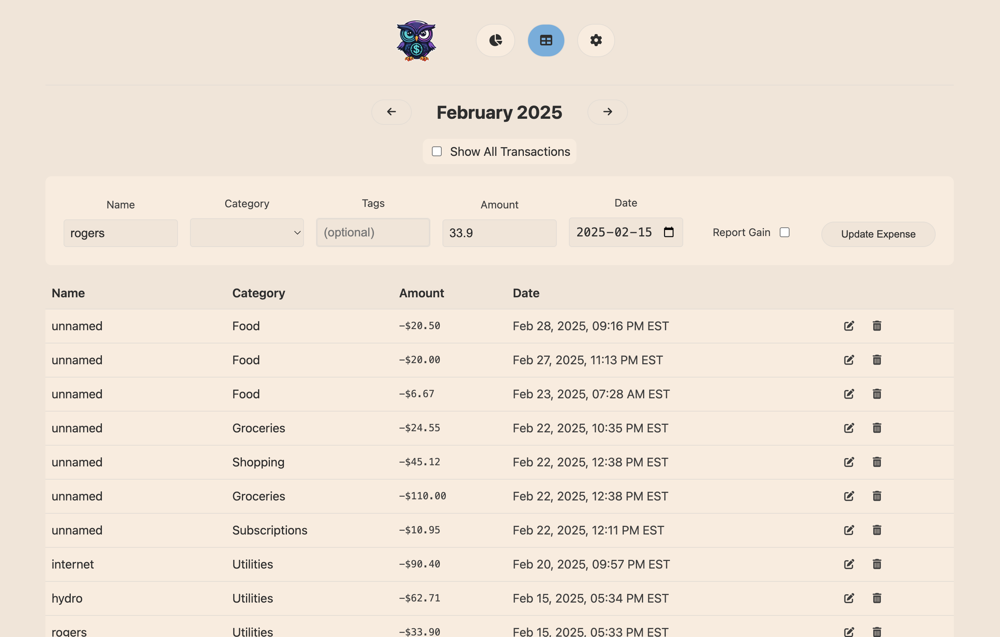 | 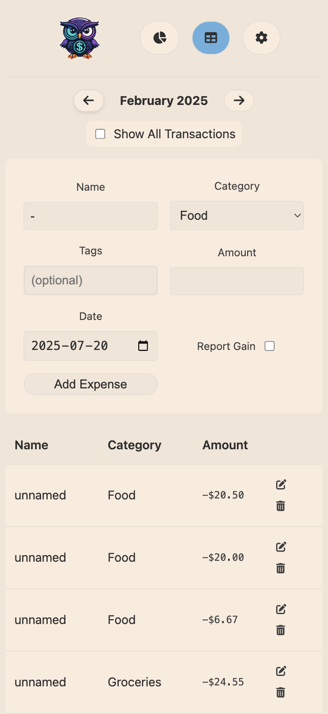 |
| Settings Dark | 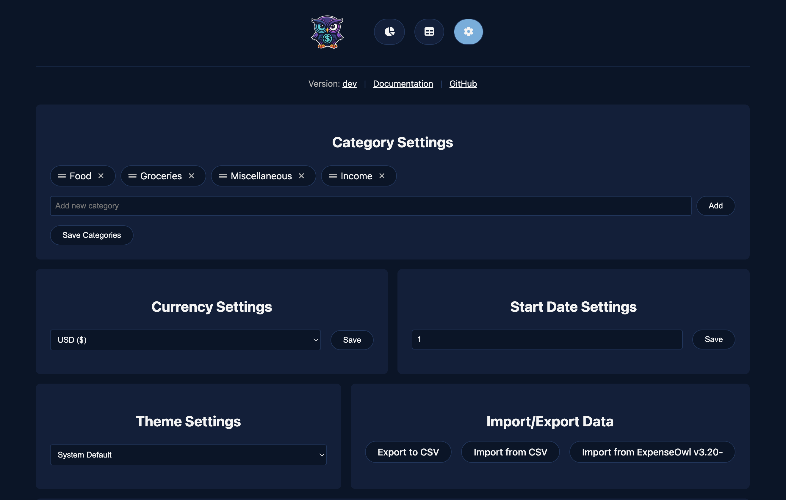 | 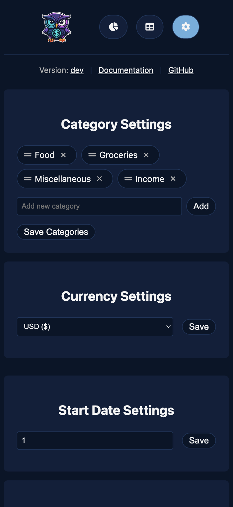 |
| Settings Light | 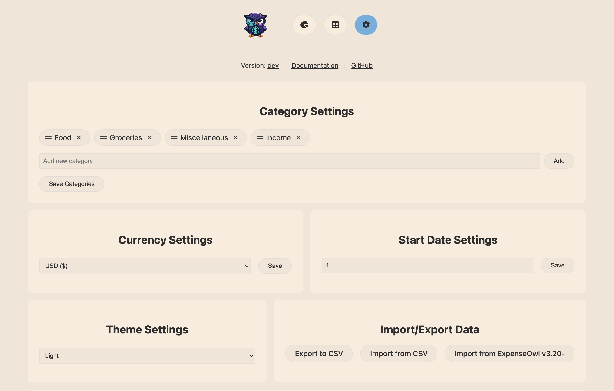 | 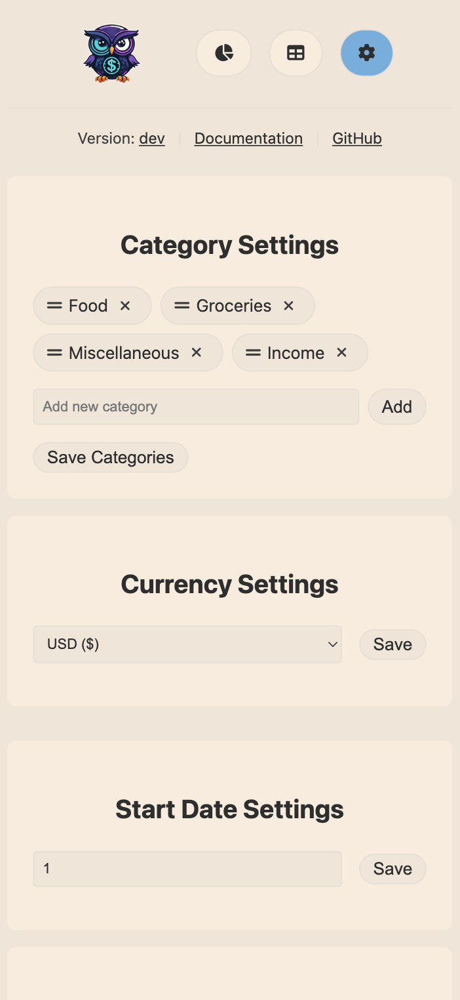 |

</details>


Check out a 🚀 Demo of the project:

https://github.com/user-attachments/assets/1534a412-1dd6-446a-92f8-00eab935afac
